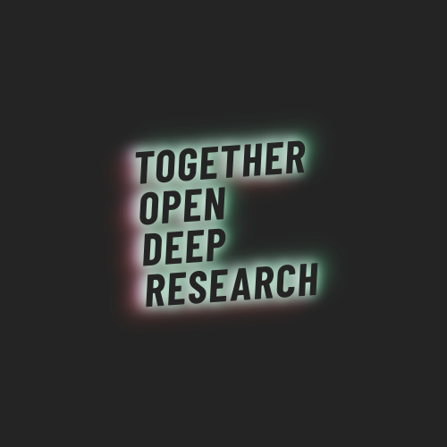

<div align="center">
  
  <h1>Together Open Deep Research</h1>
  <p><em>AI-powered comprehensive research on complex topics</em></p>

  <p>
    <a href="https://www.together.ai/blog/open-deep-research" target="_blank">Blog Post</a> •
    <a href="#overview">Overview</a> •
    <a href="#features">Features</a> •
    <a href="#installation">Installation</a> •
    <a href="#usage">Usage</a> •
    <a href="#disclaimer">Disclaimer</a>
  </p>
</div>

---

## <a id="overview"></a> ✨ Overview

Together Open Deep Research is an agentic LLM workflow that delivers in-depth research on complex topics requiring multi-hop reasoning. It enhances traditional web search by producing comprehensive, well-cited content that mimics the human research process - planning, searching, evaluating information, and iterating until completion.

## <a id="features"></a> 🎯 Features

- **Comprehensive Research Reports** - Generates long-form, well-cited content on complex topics
- **Multi-Stage Process** - Uses multiple self-reflection stages for quality information gathering
- **Source Verification** - Provides citations for all information sources
- **Extensible Architecture** - Designed with a flexible foundation for community extension

## <a id="installation"></a> 🔧 Installation

### Prerequisites

Before installing, ensure you have Python 3.12+ and the following tools:

<table>
  <tr>
    <th>Tool</th>
    <th>macOS</th>
    <th>Ubuntu/Debian</th>
    <th>Windows</th>
  </tr>
  <tr>
    <td>Pandoc</td>
    <td><code>brew install pandoc</code></td>
    <td><code>sudo apt-get install pandoc</code></td>
    <td><a href="https://pandoc.org/installing.html">Download installer</a></td>
  </tr>
  <tr>
    <td>pdfLaTeX</td>
    <td><code>brew install basictex</code></td>
    <td><code>sudo apt-get install texlive-xetex</code></td>
    <td><a href="https://miktex.org/download">Download MiKTeX</a></td>
  </tr>
</table>

### Setup Environment

```bash
# Install uv (faster alternative to pip)
curl -LsSf https://astral.sh/uv/install.sh | sh

# Create and activate virtual environment
uv venv --python=3.12
source .venv/bin/activate

# Install project dependencies
uv pip install -r pyproject.toml
uv lock --check

# Optional: install with open-deep-research package (for langgraph evals)
uv pip install -e ".[with-open-deep-research]"
```

### Configure API Keys

```bash
export TOGETHER_API_KEY=your_key_here
export TAVILY_API_KEY=your_key_here
export HUGGINGFACE_TOKEN=your_token_here
```

## <a id="usage"></a> 🚀 Usage

Run the deep research workflow:

```bash
# Set Python path
export PYTHONPATH=$PYTHONPATH:$(pwd)/src

# Run with default options
python src/together_open_deep_research.py --config configs/open_deep_researcher_config.yaml
```

Or run the gradio webapp:

```bash
python src/webapp.py
```

### Options

- `--write-pdf` - Generate a PDF document of the report
- `--write-html` - Create an HTML version of the report
- `--write-podcast` - Create a Podcast of the entire artcle
- `--add-toc-image` - Add a visual table of contents image
- `--config PATH` - Specify a custom configuration file (default: `configs/open_deep_researcher_config.yaml`)

## <a id="disclaimer"></a> ⚠️ Disclaimer

As an LLM-based system, this tool may occasionally:

- Generate hallucinations or fabricate information that appears plausible
- Contain biases present in its training data
- Misinterpret complex queries or provide incomplete analyses
- Present outdated information

**Always verify important information from generated reports with primary sources.**

